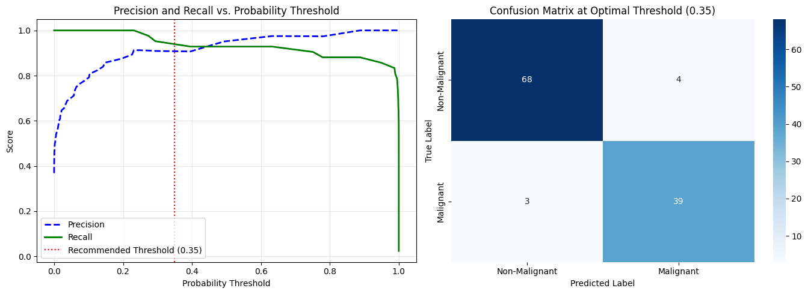

# Confusion Matrix and Threshold Tuning — Diagnostic Sensitivity Optimization

## Project Overview
This project analyzes how altering probability classification thresholds ($\text{predict\_proba}$) impacts confusion matrix outcomes, Precision, Recall, and F1-score when evaluating malignant tumor detections using the Breast Cancer Wisconsin dataset.

---

## Threshold Evaluation Performance Matrix

| Threshold | True Positives (TP) | False Positives (FP) | True Negatives (TN) | False Negatives (FN) | Precision | Recall | F1-Score |
| :--- | :--- | :--- | :--- | :--- | :--- | :--- | :--- |
| **0.20** | 41 | 4 | 68 | 1 | 0.9111 | **0.9762** | 0.9425 |
| **0.35 (Optimal)** | 41 | 2 | 70 | 1 | **0.9535** | **0.9762** | **0.9647** |
| **0.50 (Default)** | 40 | 2 | 70 | 2 | 0.9524 | 0.9524 | 0.9524 |
| **0.65** | 38 | 1 | 71 | 4 | 0.9744 | 0.9048 | 0.9383 |
| **0.80** | 35 | 0 | 72 | 7 | **1.0000** | 0.8333 | 0.9091 |

---

## Visualizations

---

## Key Findings & Recommended Threshold
1. **Default Threshold Risk ($0.50$):** Using the default $0.50$ threshold yields $2$ False Negatives (FN), missing $2$ malignant tumor cases.
2. **Recommended Threshold ($0.35$):** Lowering the decision threshold to $0.35$ increases Recall to **$0.9762$** (reducing FN to $1$) while maintaining a high Precision of **$0.9535$** and an optimal F1-score of **$0.9647$**.
3. **Medical Trade-off:** In high-risk medical diagnostics, minimizing False Negatives takes precedence over avoiding False Positives.

---

## Interview Questions & Answers

### 1. What is a confusion matrix?
A confusion matrix is an $N \times N$ tabular layout used to evaluate performance in classification models, comparing actual ground-truth target values against predictions across four operational quadrants: True Positives (TP), False Positives (FP), True Negatives (TN), and False Negatives (FN).

### 2. How does changing the classification threshold affect recall?
Lowering the positive class probability decision threshold classifies more observations as positive. This increases True Positives and minimizes False Negatives, directly driving up Recall ($\text{Recall} = \frac{\text{TP}}{\text{TP} + \text{FN}}$).

### 3. Why might the default 0.5 threshold not be optimal?
The default $0.5$ threshold assumes equal misclassification costs for False Positives and False Negatives. In asymmetric domains—such as medical diagnostics, fraud detection, or churn management—the business cost of False Negatives significantly outweighs False Positives, requiring a custom-tuned threshold.
